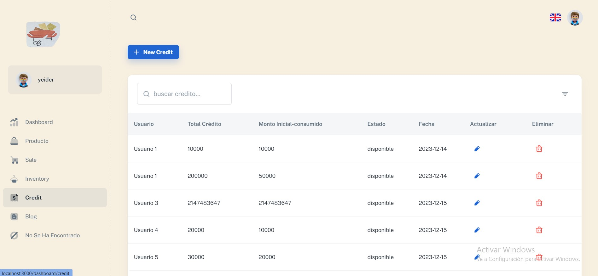

# Minimal React Admin Dashboard

[Minimal React Admin Dashboard](https://minimal-kit-react.vercel.app/) es un panel de administración gratuito desarrollado con componentes Material-UI y React. Este proyecto es una herramienta poderosa para crear aplicaciones de administración elegantes y funcionales.

## Características Destacadas

- **6 páginas de demostración** que muestran diversas funcionalidades.
- **Multi-idioma** para llegar a una audiencia global.
- **Modo Claro/Oscuro** para adaptarse a las preferencias del usuario.
- **Más de 50 páginas de demostración** disponibles en la versión completa.
- **Compatibilidad con Next.js** para una experiencia de desarrollo mejorada.
- **Versión con TypeScript** para un desarrollo más seguro y productivo.
- **Archivos de diseño** disponibles en Figma y Sketch para facilitar la personalización.

## Demostraciones

Puedes explorar las siguientes páginas de demostración:

- [Dashboard](https://minimal-kit-react.vercel.app/dashboard/app)
- [Usuarios](https://minimal-kit-react.vercel.app/dashboard/user)
- [Productos](https://minimal-kit-react.vercel.app/dashboard/products)
- [Blog](https://minimal-kit-react.vercel.app/dashboard/blog)
- [Inicio de Sesión](https://minimal-kit-react.vercel.app/login)
- [Página no encontrada](https://minimal-kit-react.vercel.app/404)

## Comenzar

Para comenzar con este proyecto, sigue estos pasos:

1. Asegúrate de tener **Node.js 16.x** y **npm 6+** instalados en tu sistema (se recomienda la versión 16.15.0 de Node.js).
2. Instala las dependencias ejecutando `npm install` o `yarn install`.
3. Inicia el proyecto con `npm run start` o `yarn start`.

## Licencia

Este proyecto se distribuye bajo la **Licencia MIT**. Consulta [LICENSE](https://github.com/minimal-ui-kit/minimal.free/blob/main/LICENSE.md) para obtener más información.

## Contáctanos

Si tienes alguna pregunta o necesitas asistencia, no dudes en contactarnos por correo electrónico: [support@minimals.cc](jossajhon123454@gmail.com).

